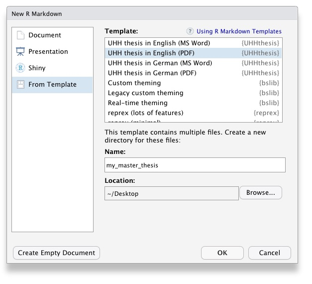

```{r setup, include=FALSE}
knitr::opts_chunk$set(echo = TRUE)
```

<!-- README.md is generated from README.Rmd. Please edit that file -->

# UHHthesis 

This package is a customized version of the original [thesisdown](https://github.com/ismayc/thesisdown) package developed by Chester Ismay for the Reed College. It creates a *bookdown* project structure with German or English LaTeX and Word thesis templates from the University of Hamburg (UHH), which conform to the submission standards of the MIN faculty for Bachelor and Master theses. The package is primarily designed for the Biology Department as part of its new 'Data Science in Biology' program but can be used by any UHH student. It aims to encourage students to conduct reproducible research using simple Markdown syntax while embedding all of the R code to produce plots and analyses as well.

The package contains currently four templates:

1. [PDF output for thesis written in German](https://github.com/saskiaotto/UHHthesis/blob/master/resources/examples/ex_thesis_pdf_de.pdf) (generated using the function `thesis_pdf_de()`)
2. [PDF output for thesis written in English](https://github.com/saskiaotto/UHHthesis/blob/master/resources/examples/ex_thesis_pdf_en.pdf) (generated using the function `thesis_pdf_en()`)
3. [Microsoft Word output for thesis written in German](https://github.com/saskiaotto/UHHthesis/blob/master/resources/examples/ex_thesis_word_de.docx) (generated using the function `thesis_word_de()`)
4. [Microsoft Word output for thesis written in English](https://github.com/saskiaotto/UHHthesis/blob/master/resources/examples/ex_thesis_word_en.docx) (generated using the function `thesis_word_en()`)

Each templates generates a project structure with all required files, which are already pre-filled with text as a starting help or documentation. If you are new to working with [bookdown](https://bookdown.org/) and [rmarkdown](https://rmarkdown.rstudio.com/), please read over this documentation. To learn more about the *bookdown* and *rmarkdown* packages in general, I highly recommend the following two online books (see also [Useful resources]):

- [R Markdown: The Definitive Guide](https://bookdown.org/yihui/rmarkdown/) by Yihui Xie, J. J. Allaire, and Garrett Grolemund
- [bookdown: Authoring Books and Technical Documents with R Markdown](https://bookdown.org/yihui/bookdown/) by Yihui Xie


## Installation

**NEW: The package repository has been moved to the new GitHub account of the Department of Biology, University of Hamburg: [github.com/uham-bio](https://github.com/uham-bio)!!!!!!**

Install the *bookdown* and *UHHthesis* packages. Note that *UHHthesis* is **not** available on CRAN so you have to install it from GitHub using the *remotes* package as shown below.

```{r, eval = FALSE}
# bookdown
if (!require("bookdown")) install.packages("bookdown")

# remotes and UHHthesis
if (!require("remotes")) install.packages("remotes")
remotes::install_github("uham-bio/UHHthesis", build_vignettes = TRUE)
```


## Getting started

### Creating a new project and rendering it within R Studio

Once you installed the package you might need to close and re-open R Studio to see the `UHHthesis` 
templates listed.

1. Choose **File** > **New File** > **R Markdown**, then select **From Template**.
You should then be able to create a new document from one of the package templates:

```{r, echo=FALSE, fig.align='center', fig.alt="demo create document"}

```

2. Choose the directory in which you want to save your project and provide a project name. In the screenshot above I name it `my_master_thesis` and save it on my desktop. That name will be used for both the main .Rmd file and the new project folder. 
3. Now change the working directory to this new project folder.
4. In a next step, you need to rename this .Rmd file (in my case `my_master_thesis.Rmd`) to `index.Rmd`. If you forget to rename it you will get an error message when rendering the file

```{r, echo=FALSE, fig.align='center', out.width="100%", fig.alt="demo rename .Rmd file"}

```

5. This `index.Rmd` file is in fact **the only file in your thesis directory** you'll ever going to **knit**! If you take a look at the other .Rmd files in the project folder, you'll notice that none of them have a YAML header to tell what the output format should be like. If you are going to press the *knit* button for these files, R Studio will simply render them into single HTML files as default. **If it is your first time using this package I highly recommend to knit the `index.Rmd` immediately and use the output file as documentation on how to get started!**

```{r, echo=FALSE, fig.align='center', out.width="75%", fig.alt="demo knit index file"}

```

6. The output PDF or Microsoft Word thesis file rendered from the `index.Rmd` file will be placed in a new `thesis-output/` subdirectory along with its LaTeX or Markdown file. 


### Shortcut for the English PDF version

If you'll write your thesis in English and want the PDF output format, there is another way to create the thesis project file:

1. In RStudio, click on **File** > **New Project** > **New Directory**. 
2. Then select **Thesis Project using UHHthesis (English PDF)** from the dropdown that will look something like the image below. You'll see the graduation cap as the icon on the left for the appropriate project type.
3. Next, give your project a name and specify where you'd like the files to appear. This time the main .Rmd file will be named automatically `index.Rmd`, so you don't need to do anything further.

```{r, echo=FALSE, fig.align='center', out.width="100%", fig.alt="demo create project"}

```


### Further requirements - LaTeX

In addition to Pandoc or R Studio being installed, you need to have [LaTeX](https://www.latex-project.org/about/) installed if you want to use the templates that convert R Markdown to PDF output formats. Depending on your operating systems there are different distributions you can use, e.g. for Mac there is [MacTeX](http://www.tug.org/mactex/), which includes [TeXShop](https://pages.uoregon.edu/koch/texshop/), a nice Mac-only editor for .tex documents. For other OS see here: https://www.latex-project.org/get/

An easy way to install LaTeX on any platform is with the [tinytex](https://yihui.org/tinytex/) R package:

```{r, eval=FALSE}
install.packages('tinytex')
tinytex::install_tinytex()
# After restarting R Studio, confirm that you have LaTeX with 
tinytex:::is_tinytex() 
```

TinyTeX is a custom LaTeX distribution based on TeX Live that is small in size but that includes most relevant functions (for R users). You may, however, still need to install a few extra LaTeX packages on your first attempt to knit when you use this package.

Although LaTeX is a powerful and popular tool in Academia, it can take a while to learn the syntax and to find the correct formatting. R Markdown and the PDF template in this packages offer a much simpler syntax and the direct embedding of figures and tables, but at the cost of loosing some of the expressiveness of LaTeX. However, you can insert LaTeX code directly into the R Markdown files and also add LaTeX packages and format styles in the YAML header.

If you want to know more about LaTeX, a good start is the *overleaf* tutorial (and its entire documentation):
https://www.overleaf.com/learn/latex/Learn_LaTeX_in_30_minutes

---

## The templates

The package provides comprehensive templates following the official guidelines of the Department's Academic office for the [Bachelor thesis](https://www.biologie.uni-hamburg.de/studium/download/bachelor/vorgabe-bachelorarbeit.pdf) as well as [Master thesis](https://www.biologie.uni-hamburg.de/studium/download/master/vorgaben-masterarbeit-biologie.pdf). The template comes in four versions, two for the PDF version in German (`thesis_pdf_de`) and English (`thesis_pdf_en`) and two for the Microsoft Word version in German (`thesis_word_de`) and English (`thesis_word_en`).

The underlying functions wrap around the `pdf_book()` or `word_document2()` functions from the [bookdown](https://bookdown.org/home/about/) package, which is more suitable for books and log-format reports and which provides additional features such as figure/table caption numbering, cross-references or inserting parts/appendices. *bookdown* also allows the splitting of chapters or sections into individual files, keeping it thereby more tidy. 

The **PDF versions** follow exactly the UHH submission standards, including the layout of the title page, and the principles of open science and reproducible research as no further changes can be made manually. So ideally, you opt for this version. The underlying LaTeX templates are based on the University templates provided by the [Department of Socioeconomics](https://www.wiso.uni-hamburg.de/fachbereich-sozoek/professuren/szimayer/lehre/wissenschaftliche-arbeiten/bachelorarbeiten/vorlagen-fuer-abschlussarbeiten-in-latex-format.html) as well as the Department of Informatics working groups [VSIS](https://vsis-www.informatik.uni-hamburg.de/vsis/teaching/templates) and [Security & Privacy](https://www.inf.uni-hamburg.de/inst/ab/snp/courses/material/templates.html).

```{r, echo=FALSE, fig.align='center', out.width="100%", fig.alt="demo pdf output files in both langauges", fig.cap="This is how the PDF thesis (in both languages) will finally look like."}

```

However, if you do not want to limit yourself to the template design and would like to share your thesis with others for collaborative editing the **Word version** might be more suitable. But beware that there are currently some limitations when rendering from R Markdown to MS Word. For instance,

- the title page layout cannot be done completely from within R Markdown as in the PDF version. As a workaround, some of the text parts are currently placed under the 'author' section. The best solution is to modify the title page manually in Word right before submission. Use for the design the 'front-page-example.pdf' file.
- a table of figures and tables cannot be automatically generated as in the PDF version.


```{r, echo=FALSE, fig.align='center', out.width="100%", fig.alt="demo word output files in English", fig.cap="This is the final Word thesis document in English."}

```


### Thesis components

The following components are the ones you should edit to customize your thesis. Note that the template contains in all files some dummy text to provide you some guidance and additional information. This should be deleted of course.

#### `index.Rmd`

This file contains the [YAML](https://yaml.org/) header, i.e. all the meta information, which should always be at the beginning of your document. In fact, the file shouldn't contain anything else than that and the few code chunks right after! The text you'll see after the code chunks is just for your information and should be deleted after reading. The first lines in the YAML header are for the title page configuration. Modify these as needed. For the lines that follow you will see comments that help you to understand, which lines should remain as is and which you can modify.

#### `_bookdown.yml`

This is the main configuration file for your thesis. It determines what .Rmd files are included in the output, and in what order. Arrange the order of your chapters in this file and ensure that the names match the names in your folders. 

#### `prelim/`

This folder contains .Rmd files for the sections that come before the main part of your thesis, i.e. the *Abstract*, *Zusammenfassung* (the German summary), and the *List of Abbreviations* (optional). The *List of Tables* and *List of Figures*, which are also optional, are automatically generated so no further .Rmd file is required.

#### `chapter/`

This folder contains the .Rmd files for each chapter in your dissertation (e.g. `01-intro.Rmd`, `02-methods.Rmd`, etc.). Write your thesis in these. If you're writing in R Studio, you may find the package [wordcountaddin](https://github.com/benmarwick/wordcountaddin) useful for getting word counts and readability statistics in R Markdown documents.

#### `bib/`

Store your bibliography (as .bib file(s)) and your style file (as .csl file) here. A good source for
citation styles is this [CSL Style Repository](https://github.com/citation-style-language/styles#readme). A useful tool for easy citation insertions is the [citr](https://github.com/crsh/citr) add-in. If you are using the reference management software [Zotero](https://www.zotero.org/) the add-in can even access your reference database directly. 

#### `data/` and `images/`

Store your data files and all external images that are embedded in your thesis here and reference them in your R Markdown files. See the *method* chapter in the template and chapter [2.2.1](https://bookdown.org/yihui/bookdown/markdown-extensions-by-bookdown.html#equations) in the bookdown online documentation for details on cross-referencing tables and figures in R Markdown.


### Day-to-day writing of your thesis

You need to edit the individual chapter R Markdown files to write your thesis. To see the changes in your thesis document, knit the `index.rmd` file right after. It is recommended that you use version control your thesis using GitHub or GitLab (provided by the UHH) if possible. RStudio can also easily sync up with GitHub or GitLab to make the process easier. While writing, you should 'commit' your work frequently, after every major activity on your thesis. For example, every few paragraphs or section of text, and after major steps of analysis development. At the end of each work session before you leave your computer or change tasks you should 'push' all your changes, i.e. commits to the remote repo. 


### Fine-tuning the thesis format at the very last moment

Running some manual fine tuning in the Word document at the end is easy, but if you use as output the PDF version this can be a bit more challenging: 

- If you like to change some of the format and are familiar with LaTeX you can also open the rendered `thesis.tex` file in your system's LaTeX editor, make the changes and recompile it. But note that whenever you *knit* your `index.Rmd` again, your changes in the LaTeX file will be overwritten. So this should be only done once the content of your thesis doesn't change.
- A better way to add your personal format style is to add LaTeX code in the YAML header under the option `header-includes:` since that style will be included every time you render your document. 


----


## Useful resources

- R Markdown
    - The official [R Markdown documentation](https://rmarkdown.rstudio.com/lesson-1.html) from RStudio
    - R Markdown [reference guide](https://www.rstudio.com/wp-content/uploads/2015/03/rmarkdown-reference.pdf)
    - R Markdown [cheatsheet](https://github.com/rstudio/cheatsheets/raw/master/rmarkdown-2.0.pdf)
    - The online book [R Markdown: The Definitive Guide](https://bookdown.org/yihui/rmarkdown/) by Yihui Xie, J. J. Allaire, and Garrett Grolemund
- Bookdown
    - The online book [bookdown: Authoring Books and Technical Documents with R Markdown](https://bookdown.org/yihui/bookdown/) by Yihui Xie
- LaTeX
    - The official [LaTeX help and documentation](https://www.latex-project.org/help/documentation/)
    - The [overleaf](https://www.overleaf.com/learn) documentation
- Git
    - The online book [Happy Git and GitHub for the useR](https://happygitwithr.com/) is a novice-friendly guide to getting starting with using Git with R and RStudio.

